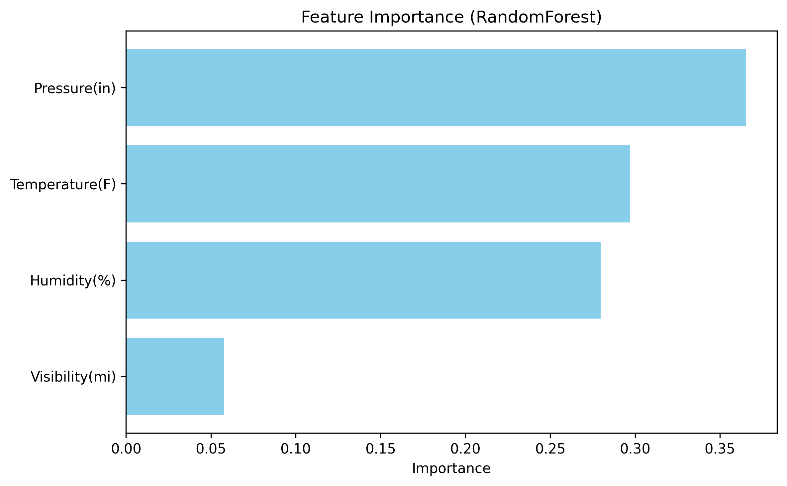

#  U.S. Road Accidents Analysis (2016–2023)

This project analyzes several million road accidents in the United States to identify  
the **factors influencing severity**, **temporal trends**, and **weather-related risk conditions**.

---

##  Project Objective
- Understand major factors related to accidents (weather, visibility, time, state…)
- Study temporal trends (day, month, peak hours)
- Identify the most accident-prone areas
- Explore the relationship between **severity** and **weather conditions**
- Produce clear and professional visualizations

---

##  Project Structure
├── data/
│   ├── raw/          # Raw data
│   └── processed/    # Cleaned data
├── notebooks/
│   ├── 01_cleaning.ipynb
│   ├── 02_exploration.ipynb
│   ├── 03_visualisation.ipynb
│   └── 04_summary.ipynb
├── src/
│   └── data_prep.py  # Reusable scripts
├── outputs/
│   ├── graphs/       # Generated graphs
│   └── reports/      # Final PDF report
└── README.md

---

##  Technologies Used
- **Python 3.12**
- **Pandas**, **NumPy**
- **Matplotlib**, **Seaborn**
- **Folium** (interactive map)
- Jupyter Notebook

---

##  Key Findings

###  Accident Severity
- Severity **2** represents the large majority of accidents.
- Severe accidents (3 and 4) are strongly influenced by weather.

###  High-Risk Weather Conditions
- **Heavy Rain**, **Snow**, **Thunderstorms** → higher severity.
- **Clear** and **Fair** → lower severity.

###  Temporal Trends
- Accident peak occurs between **4 PM and 7 PM** (rush hours).
- Friday and Saturday → most accident-prone days.

###  Geographic Insights
- Most affected states: **California**, **Texas**, **Florida**.

---

##  Notebooks

- **Data Cleaning** → `01_cleaning.ipynb`  
- **Exploration** → `02_exploration.ipynb`  
- **Visualizations** → `03_visualisation.ipynb`  
- **Final Summary** → `04_summary.ipynb`
- **Modèle prédictif (baseline)** → `05_model_baseline.ipynb`

---
## Prochaines étapes
- Améliorer le modèle de prédiction (RandomForest → XGBoost / LightGBM)
- Ajouter une évaluation plus avancée (ROC-AUC, confusion matrix)

---

# Screenshots of Graphs 

### Severity Distribution

  

### Top 10 Most Accident-Prone States

  

### Top 10 Weather Conditions

  

### Severity by Weather Condition (Top 12)

  

### Accidents per Hour

  

### Correlation Matrix

  

### Importance des variables (Feature Importance)

  

Ce graphique montre quelles variables météo influencent le plus la gravité des accidents.

---

###  Modèle prédictif (baseline)

Un modèle simple **RandomForestClassifier** a été entraîné pour prédire la gravité des accidents
à partir de quelques variables météo (visibilité, température, humidité, pression).

- Le modèle offre une première estimation de la gravité.
- Il permet d’identifier les variables les plus importantes (feature importance).
---

##  PDF Report
Available here → `outputs/reports/rapport_analyse_accidents.pdf`

---

##  Author
**Iliass Gzouli**  
[Email](mailto:iliassgzouli@gmail.com)
[LinkedIn](https://www.linkedin.com/in/iliass-gzouli-b0615a324/)  
[GitHub](https://github.com/IliassGzouli)  

---

##  Badges

